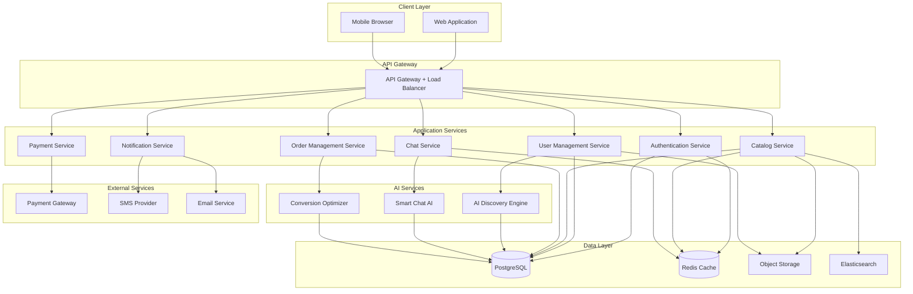

# Design Document: Electronics Marketplace Platform

## Overview

The Electronics Marketplace Platform is a comprehensive web-based system designed to connect buyers and sellers of electronic components in India. The platform addresses the current market gap where Indian buyers must rely on Chinese sellers for components like Arduino boards, sensors, and custom PCBs.

The architecture follows a microservices approach with three core AI-powered subsystems:

1. **AI Discovery Engine**: Automatically identifies and onboards service providers
2. **Smart Chat System**: Filters noise queries and routes genuine inquiries to sellers
3. **Conversion Optimizer**: Provides data-driven insights to improve seller conversion rates

The platform supports both individual buyers (hobbyists, students, makers) and business buyers (bulk orders, manufacturers), with specialized workflows for each user type.

## Architecture

### High-Level Architecture



### Technology Stack

- **Frontend**: React.js with TypeScript, Tailwind CSS for responsive design
- **API Gateway**: Kong or AWS API Gateway
- **Backend Services**: Node.js with Express.js (TypeScript)
- **AI/ML Services**: Python with FastAPI, TensorFlow/PyTorch for ML models
- **Databases**: 
  - PostgreSQL for transactional data
  - Redis for caching and real-time features
  - Elasticsearch for product search
- **Object Storage**: AWS S3 or compatible service for images and documents
- **Message Queue**: RabbitMQ or AWS SQS for asynchronous processing
- **Payment Integration**: Razorpay or Stripe for Indian market

### Deployment Architecture

- **Container Orchestration**: Kubernetes for service deployment and scaling
- **CI/CD**: GitHub Actions or GitLab CI
- **Monitoring**: Prometheus + Grafana for metrics, ELK stack for logs
- **Cloud Provider**: AWS, Azure, or GCP (multi-region deployment for India)

## Components and Interfaces

### 1. Authentication Service

**Responsibility**: User registration, login, session management, and authorization.

**Key Interfaces**:

```typescript
interface AuthService {
  // Register new user
  register(userData: UserRegistrationData): Promise<UserAccount>;
  
  // Authenticate user
  login(credentials: LoginCredentials): Promise<AuthToken>;
  
  // Validate token
  validateToken(token: string): Promise<TokenValidation>;
  
  // Refresh authentication token
  refreshToken(refreshToken: string): Promise<AuthToken>;
  
  // Logout user
  logout(token: string): Promise<void>;
  
  // Handle account lockout
  handleFailedLogin(userId: string): Promise<LockoutStatus>;
}

interface UserRegistrationData {
  email: string;
  password: string;
  role: 'buyer' | 'seller';
  name: string;
  phone: string;
}

interface LoginCredentials {
  email: string;
  password: string;
}

interface AuthToken {
  accessToken: string;
  refreshToken: string;
  expiresIn: number;
  userId: string;
}
```

**Implementation Details**:
- Password hashing using bcrypt with salt rounds of 12
- JWT tokens for stateless authentication
- Redis for token blacklisting and session management
- Account lockout tracking in Redis with 15-minute TTL

### 2. Catalog Service

**Responsibility**: Product listing management, search, and discovery.

**Key Interfaces**:

```typescript
interface CatalogService {
  // Create new component listing
  createComponent(sellerId: string, component: ComponentData): Promise<Component>;
  
  // Update component information
  updateComponent(componentId: string, updates: Partial<ComponentData>): Promise<Component>;
  
  // Search components
  searchComponents(query: SearchQuery): Promise<SearchResults>;
  
  // Get component details
  getComponent(componentId: string): Promise<Component>;
  
  // Update inventory
  updateInventory(componentId: string, quantity: number): Promise<void>;
}

interface ComponentData {
  name: string;
  description: string;
  category: ComponentCategory;
  specifications: TechnicalSpecs;
  pricing: PricingInfo;
  inventory: number;
  images: string[];
  sellerId: string;
}

interface SearchQuery {
  keyword?: string;
  category?: ComponentCategory;
  priceRange?: { min: number; max: number };
  sellerLocation?: string;
  inStock?: boolean;
  specifications?: Partial<TechnicalSpecs>;
  page: number;
  pageSize: number;
}

interface SearchResults {
  components: Component[];
  totalCount: number;
  page: number;
  pageSize: number;
  facets: SearchFacets;
}

enum ComponentCategory {
  MICROCONTROLLERS = 'microcontrollers',
  SENSORS = 'sensors',
  BOARDS = 'boards',
  PASSIVE_COMPONENTS = 'passive_components',
  POWER_SUPPLIES = 'power_supplies',
  DISPLAYS = 'displays',
  COMMUNICATION_MODULES = 'communication_modules',
  OTHER = 'other'
}
```

**Implementation Details**:
- Elasticsearch for full-text search with custom analyzers for technical terms
- PostgreSQL for component metadata and relationships
- Redis caching for frequently accessed components (TTL: 5 minutes)
- Image storage in S3 with CDN distribution
- Real-time inventory updates using database triggers

### 3. Order Management Service

**Responsibility**: Order creation, tracking, fulfillment, and bulk order workflows.

**Key Interfaces**:

```typescript
interface OrderService {
  // Create new order
  createOrder(buyerId: string, orderData: OrderData): Promise<Order>;
  
  // Update order status
  updateOrderStatus(orderId: string, status: OrderStatus, metadata?: any): Promise<Order>;
  
  // Get order details
  getOrder(orderId: string): Promise<Order>;
  
  // Request bulk quote
  requestBulkQuote(buyerId: string, quoteRequest: BulkQuoteRequest): Promise<QuoteRequest>;
  
  // Respond to bulk quote
  respondToQuote(sellerId: string, quoteId: string, response: QuoteResponse): Promise<Quote>;
  
  // Cancel order
  cancelOrder(orderId: string, reason: string): Promise<Order>;
  
  // Track order
  getOrderTracking(orderId: string): Promise<TrackingInfo>;
}

interface OrderData {
  componentId: string;
  quantity: number;
  deliveryAddress: Address;
  specialInstructions?: string;
}

interface BulkQuoteRequest {
  componentId: string;
  quantity: number;
  targetPrice?: number;
  deliveryTimeline: string;
  requirements: string;
}

enum OrderStatus {
  PENDING = 'pending',
  CONFIRMED = 'confirmed',
  PROCESSING = 'processing',
  SHIPPED = 'shipped',
  DELIVERED = 'delivered',
  CANCELLED = 'cancelled'
}

interface Order {
  id: string;
  buyerId: string;
  sellerId: string;
  componentId: string;
  quantity: number;
  totalAmount: number;
  status: OrderStatus;
  createdAt: Date;
  updatedAt: Date;
  deliveryAddress: Address;
  trackingInfo?: TrackingInfo;
}
```

**Implementation Details**:
- Event-driven architecture using message queue for order state transitions
- Bulk order threshold: 100 units for standard bulk, 1000+ for custom quotes
- Order status notifications via Notification Service
- Integration with inventory management for stock reservation

### 4. Payment Service

**Responsibility**: Payment processing, escrow management, and invoice generation.

**Key Interfaces**:

```typescript
interface PaymentService {
  // Initiate payment
  initiatePayment(orderId: string, amount: number, method: PaymentMethod): Promise<PaymentSession>;
  
  // Process payment callback
  processPaymentCallback(paymentData: PaymentCallbackData): Promise<PaymentResult>;
  
  // Hold payment in escrow
  holdInEscrow(paymentId: string): Promise<EscrowStatus>;
  
  // Release payment to seller
  releasePayment(paymentId: string): Promise<void>;
  
  // Process refund
  processRefund(paymentId: string, amount: number, reason: string): Promise<Refund>;
  
  // Generate invoice
  generateInvoice(orderId: string): Promise<Invoice>;
}

enum PaymentMethod {
  UPI = 'upi',
  CREDIT_CARD = 'credit_card',
  DEBIT_CARD = 'debit_card',
  NET_BANKING = 'net_banking',
  WALLET = 'wallet'
}

interface PaymentSession {
  sessionId: string;
  orderId: string;
  amount: number;
  paymentUrl: string;
  expiresAt: Date;
}

interface EscrowStatus {
  paymentId: string;
  status: 'held' | 'released' | 'refunded';
  heldUntil: Date;
  amount: number;
}
```

**Implementation Details**:
- Integration with Razorpay for Indian payment methods
- Escrow period: 7 days after delivery or buyer confirmation
- Automatic invoice generation using PDF library
- Payment retry mechanism with exponential backoff
- PCI DSS compliance for card data handling

### 5. Chat Service

**Responsibility**: Real-time messaging between buyers and sellers.

**Key Interfaces**:

```typescript
interface ChatService {
  // Send message
  sendMessage(senderId: string, recipientId: string, message: MessageData): Promise<Message>;
  
  // Get conversation history
  getConversation(userId1: string, userId2: string, pagination: Pagination): Promise<Message[]>;
  
  // Mark messages as read
  markAsRead(userId: string, messageIds: string[]): Promise<void>;
  
  // Get unread count
  getUnreadCount(userId: string): Promise<number>;
}

interface MessageData {
  content: string;
  attachments?: string[];
  metadata?: any;
}

interface Message {
  id: string;
  senderId: string;
  recipientId: string;
  content: string;
  timestamp: Date;
  read: boolean;
  intentScore?: number; // From Smart Chat AI
}
```

**Implementation Details**:
- WebSocket connections for real-time messaging
- Redis pub/sub for message distribution across server instances
- Message history stored in PostgreSQL
- Integration with Smart Chat AI for intent analysis

### 6. Smart Chat AI Service

**Responsibility**: Analyze chat messages for purchase intent and filter noise queries.

**Key Interfaces**:

```typescript
interface SmartChatAI {
  // Analyze message intent
  analyzeIntent(message: string, context: ChatContext): Promise<IntentAnalysis>;
  
  // Generate automated response
  generateAutoResponse(message: string, context: ChatContext): Promise<string>;
  
  // Update model with feedback
  provideFeedback(messageId: string, wasGenuine: boolean): Promise<void>;
  
  // Calculate priority score
  calculatePriority(buyerId: string, message: string): Promise<number>;
}

interface ChatContext {
  buyerId: string;
  buyerReputation: number;
  buyerHistory: PurchaseHistory[];
  conversationHistory: Message[];
  componentContext?: Component;
}

interface IntentAnalysis {
  isGenuineIntent: boolean;
  confidence: number;
  intentType: 'purchase' | 'inquiry' | 'negotiation' | 'noise';
  suggestedAction: 'route_to_seller' | 'auto_respond' | 'escalate';
  priorityScore: number;
}
```

**Implementation Details**:
- ML model: Fine-tuned BERT or similar transformer model for intent classification
- Training data: Historical chat conversations labeled by sellers
- Features: Message content, buyer reputation, purchase history, time of day, message length
- Noise query indicators: Generic questions, price-only inquiries without context, copy-paste messages
- Auto-response templates for common noise queries
- Continuous learning from seller feedback
- Priority routing: High reputation buyers (>70) bypass filtering

### 7. AI Discovery Engine

**Responsibility**: Automatically discover and onboard service providers.

**Key Interfaces**:

```typescript
interface AIDiscoveryEngine {
  // Scan for potential service providers
  scanSources(): Promise<void>;
  
  // Extract provider information
  extractProviderInfo(source: string): Promise<ProviderCandidate>;
  
  // Evaluate provider quality
  evaluateProvider(candidate: ProviderCandidate): Promise<QualityScore>;
  
  // Generate onboarding invitation
  generateInvitation(candidate: ProviderCandidate): Promise<Invitation>;
  
  // Track invitation status
  trackInvitation(invitationId: string): Promise<InvitationStatus>;
}

interface ProviderCandidate {
  businessName: string;
  contactEmail: string;
  contactPhone: string;
  website: string;
  location: string;
  productCategories: string[];
  estimatedInventorySize: number;
  onlinePresence: OnlinePresence;
}

interface QualityScore {
  score: number; // 0-100
  factors: {
    productDiversity: number;
    geographicCoverage: number;
    businessReputation: number;
    onlinePresence: number;
  };
  recommendation: 'invite' | 'monitor' | 'reject';
}

interface OnlinePresence {
  hasWebsite: boolean;
  socialMediaProfiles: string[];
  marketplaceListings: string[];
  reviews: Review[];
}
```

**Implementation Details**:
- Web scraping: Scrapy or Beautiful Soup for data extraction
- Data sources: IndiaMART, TradeIndia, Google Business listings, LinkedIn, industry directories
- NLP for product category extraction from website content
- Quality scoring algorithm:
  - Product diversity: 30% weight (number of unique categories)
  - Geographic coverage: 20% weight (shipping capabilities)
  - Business reputation: 30% weight (reviews, years in business)
  - Online presence: 20% weight (website quality, social media)
- Invitation follow-up: Automated email after 7 days
- Rate limiting: Respect robots.txt and implement polite crawling

### 8. Conversion Optimizer

**Responsibility**: Provide data-driven insights to sellers for improving conversion rates.

**Key Interfaces**:

```typescript
interface ConversionOptimizer {
  // Analyze buyer interaction
  analyzeBuyerInteraction(sellerId: string, buyerId: string, interaction: Interaction): Promise<Insight>;
  
  // Generate seller recommendations
  generateRecommendations(sellerId: string): Promise<Recommendation[]>;
  
  // Calculate conversion metrics
  calculateMetrics(sellerId: string, timeRange: TimeRange): Promise<ConversionMetrics>;
  
  // Segment buyers
  segmentBuyers(sellerId: string): Promise<BuyerSegment[]>;
  
  // Notify high-value opportunity
  notifyOpportunity(sellerId: string, opportunity: Opportunity): Promise<void>;
}

interface Interaction {
  type: 'view' | 'inquiry' | 'add_to_cart' | 'purchase';
  componentId: string;
  timestamp: Date;
  metadata: any;
}

interface Insight {
  buyerProfile: BuyerProfile;
  opportunityScore: number;
  suggestedActions: string[];
  competitorPricing?: PricingComparison;
}

interface ConversionMetrics {
  viewCount: number;
  inquiryRate: number;
  conversionRate: number;
  averageOrderValue: number;
  repeatCustomerRate: number;
  trendDirection: 'up' | 'down' | 'stable';
}

interface BuyerSegment {
  segmentName: string;
  buyerCount: number;
  characteristics: {
    averageReputation: number;
    averageOrderSize: number;
    purchaseFrequency: string;
  };
  conversionRate: number;
}

interface Opportunity {
  buyerId: string;
  buyerProfile: BuyerProfile;
  opportunityType: 'high_value_buyer' | 'bulk_potential' | 'repeat_customer';
  estimatedValue: number;
  suggestedActions: string[];
}
```

**Implementation Details**:
- Analytics pipeline: Stream processing with Apache Kafka or AWS Kinesis
- ML models: Gradient boosting (XGBoost) for conversion prediction
- Features: Buyer reputation, order history, browsing behavior, time on page, inquiry patterns
- Real-time notifications for high-value buyers (reputation >80, order history >5 orders)
- Pricing recommendations based on competitor analysis and market trends
- Conversion rate benchmarking against category averages
- Automated alerts when conversion rate drops >10% from baseline

### 9. Reputation Service

**Responsibility**: Calculate and manage reputation scores for buyers and sellers.

**Key Interfaces**:

```typescript
interface ReputationService {
  // Calculate reputation score
  calculateReputation(userId: string): Promise<ReputationScore>;
  
  // Submit rating
  submitRating(fromUserId: string, toUserId: string, orderId: string, rating: Rating): Promise<void>;
  
  // Get user reputation
  getReputation(userId: string): Promise<ReputationScore>;
  
  // Flag account for review
  flagAccount(userId: string, reason: string): Promise<void>;
}

interface Rating {
  score: number; // 1-5
  feedback: string;
  categories: {
    communication: number;
    productQuality?: number;
    deliveryTime?: number;
    professionalism: number;
  };
}

interface ReputationScore {
  userId: string;
  overallScore: number; // 0-100
  totalTransactions: number;
  positiveRatings: number;
  negativeRatings: number;
  recentTrend: 'improving' | 'declining' | 'stable';
  badges: string[];
}
```

**Implementation Details**:
- Reputation calculation formula:
  - Base score from average ratings (60% weight)
  - Transaction volume bonus (20% weight)
  - Recency factor: Recent transactions weighted 2x (20% weight)
  - Decay factor: Ratings older than 6 months weighted 0.5x
- Score update: Asynchronous job runs every hour
- Flagging threshold: Score <30 triggers manual review
- Badges: "Trusted Seller", "Bulk Specialist", "Fast Shipper", "Top Rated"

### 10. Notification Service

**Responsibility**: Send notifications across multiple channels.

**Key Interfaces**:

```typescript
interface NotificationService {
  // Send notification
  sendNotification(userId: string, notification: NotificationData): Promise<void>;
  
  // Send bulk notifications
  sendBulkNotifications(userIds: string[], notification: NotificationData): Promise<void>;
  
  // Update notification preferences
  updatePreferences(userId: string, preferences: NotificationPreferences): Promise<void>;
  
  // Get notification history
  getHistory(userId: string, pagination: Pagination): Promise<Notification[]>;
}

interface NotificationData {
  type: NotificationType;
  priority: 'low' | 'medium' | 'high';
  title: string;
  message: string;
  actionUrl?: string;
  metadata?: any;
}

enum NotificationType {
  ORDER_UPDATE = 'order_update',
  PAYMENT_CONFIRMATION = 'payment_confirmation',
  MESSAGE_RECEIVED = 'message_received',
  DISPUTE_CREATED = 'dispute_created',
  BULK_QUOTE_RESPONSE = 'bulk_quote_response',
  REPUTATION_UPDATE = 'reputation_update'
}

interface NotificationPreferences {
  email: boolean;
  sms: boolean;
  inApp: boolean;
  preferences: {
    [key in NotificationType]: {
      enabled: boolean;
      channels: ('email' | 'sms' | 'inApp')[];
    };
  };
}
```

**Implementation Details**:
- Multi-channel delivery: Email (SendGrid/AWS SES), SMS (Twilio/AWS SNS), In-app (WebSocket)
- Priority-based routing: High priority sends to all enabled channels
- Template engine for notification content
- Delivery tracking and retry logic
- Rate limiting to prevent notification spam

## Data Models

### User Model

```typescript
interface User {
  id: string;
  email: string;
  passwordHash: string;
  role: 'buyer' | 'seller' | 'admin';
  profile: UserProfile;
  reputationScore: number;
  createdAt: Date;
  updatedAt: Date;
  lastLoginAt: Date;
  accountStatus: 'active' | 'locked' | 'suspended';
  failedLoginAttempts: number;
  lockoutUntil?: Date;
}

interface UserProfile {
  name: string;
  phone: string;
  businessName?: string;
  gstNumber?: string;
  addresses: Address[];
  avatar?: string;
  bio?: string;
}

interface Address {
  id: string;
  line1: string;
  line2?: string;
  city: string;
  state: string;
  pincode: string;
  country: string;
  isDefault: boolean;
}
```

### Component Model

```typescript
interface Component {
  id: string;
  sellerId: string;
  name: string;
  description: string;
  category: ComponentCategory;
  specifications: TechnicalSpecs;
  pricing: PricingInfo;
  inventory: number;
  images: string[];
  status: 'active' | 'out_of_stock' | 'discontinued';
  createdAt: Date;
  updatedAt: Date;
  viewCount: number;
  inquiryCount: number;
  salesCount: number;
}

interface TechnicalSpecs {
  manufacturer?: string;
  model?: string;
  voltage?: string;
  current?: string;
  dimensions?: string;
  weight?: string;
  customFields: { [key: string]: string };
}

interface PricingInfo {
  basePrice: number;
  currency: string;
  bulkPricing?: BulkPricingTier[];
  taxRate: number;
}

interface BulkPricingTier {
  minQuantity: number;
  pricePerUnit: number;
}
```

### Order Model

```typescript
interface Order {
  id: string;
  orderNumber: string;
  buyerId: string;
  sellerId: string;
  componentId: string;
  quantity: number;
  unitPrice: number;
  totalAmount: number;
  taxAmount: number;
  status: OrderStatus;
  isBulkOrder: boolean;
  deliveryAddress: Address;
  specialInstructions?: string;
  createdAt: Date;
  updatedAt: Date;
  confirmedAt?: Date;
  shippedAt?: Date;
  deliveredAt?: Date;
  cancelledAt?: Date;
  cancellationReason?: string;
  trackingInfo?: TrackingInfo;
}

interface TrackingInfo {
  carrier: string;
  trackingNumber: string;
  estimatedDelivery: Date;
  currentStatus: string;
  statusHistory: TrackingEvent[];
}

interface TrackingEvent {
  status: string;
  location: string;
  timestamp: Date;
  description: string;
}
```

### Payment Model

```typescript
interface Payment {
  id: string;
  orderId: string;
  amount: number;
  currency: string;
  method: PaymentMethod;
  status: 'pending' | 'completed' | 'failed' | 'refunded';
  gatewayTransactionId: string;
  escrowStatus: 'held' | 'released' | 'refunded';
  escrowReleaseDate: Date;
  createdAt: Date;
  completedAt?: Date;
  refundedAt?: Date;
  refundAmount?: number;
  refundReason?: string;
}

interface Invoice {
  id: string;
  invoiceNumber: string;
  orderId: string;
  paymentId: string;
  buyerId: string;
  sellerId: string;
  items: InvoiceItem[];
  subtotal: number;
  taxAmount: number;
  totalAmount: number;
  generatedAt: Date;
  pdfUrl: string;
}

interface InvoiceItem {
  componentName: string;
  quantity: number;
  unitPrice: number;
  totalPrice: number;
}
```

### Chat Model

```typescript
interface Conversation {
  id: string;
  participant1Id: string;
  participant2Id: string;
  lastMessageAt: Date;
  createdAt: Date;
}

interface Message {
  id: string;
  conversationId: string;
  senderId: string;
  recipientId: string;
  content: string;
  attachments: string[];
  intentAnalysis?: IntentAnalysis;
  read: boolean;
  readAt?: Date;
  createdAt: Date;
}
```

### Reputation Model

```typescript
interface ReputationRecord {
  userId: string;
  overallScore: number;
  totalTransactions: number;
  totalRatings: number;
  averageRating: number;
  ratingBreakdown: {
    5: number;
    4: number;
    3: number;
    2: number;
    1: number;
  };
  badges: string[];
  lastCalculatedAt: Date;
}

interface RatingRecord {
  id: string;
  fromUserId: string;
  toUserId: string;
  orderId: string;
  overallScore: number;
  categoryScores: {
    communication: number;
    productQuality?: number;
    deliveryTime?: number;
    professionalism: number;
  };
  feedback: string;
  createdAt: Date;
}
```

### Dispute Model

```typescript
interface Dispute {
  id: string;
  orderId: string;
  raisedBy: string;
  againstUser: string;
  reason: string;
  description: string;
  status: 'open' | 'in_progress' | 'resolved' | 'escalated';
  resolution?: string;
  createdAt: Date;
  resolvedAt?: Date;
  escalatedAt?: Date;
  messages: DisputeMessage[];
}

interface DisputeMessage {
  id: string;
  disputeId: string;
  senderId: string;
  message: string;
  attachments: string[];
  createdAt: Date;
}
```

## Correctness Properties

*A property is a characteristic or behavior that should hold true across all valid executions of a system—essentially, a formal statement about what the system should do. Properties serve as the bridge between human-readable specifications and machine-verifiable correctness guarantees.*


### Property Reflection

After analyzing all acceptance criteria, I've identified the following consolidation opportunities:

**Notification Properties**: Requirements 4.2, 10.2, 10.3, 12.2, and 13.1 all test notification sending for different events. These can be consolidated into a single comprehensive property about event-driven notifications.

**Filter Properties**: Requirements 3.2 and 3.3 both test filtering behavior. 3.3 (multiple filters) subsumes 3.2 (individual filters), so we only need the comprehensive property.

**Payment Method Properties**: Requirements 11.1 and 14.5 both test payment method support. These can be combined into one property about payment method availability.

**Escrow Properties**: Requirements 11.3 and 11.4 both test escrow behavior. 11.4 (release logic) depends on 11.3 (holding logic), so they should be combined into one comprehensive escrow workflow property.

**Reputation Update Properties**: Requirements 9.2 and 9.3 both relate to reputation updates after transactions. These can be combined into one property about the rating and update workflow.

**Encryption Properties**: Requirements 15.2 and 15.3 both test encryption. These can be combined into one comprehensive property about data encryption.

### Authentication and User Management Properties

**Property 1: Valid registration creates accounts with correct roles**
*For any* valid user registration data (email, password, name, phone, role), creating an account should result in a new user record with the specified role and hashed password.
**Validates: Requirements 1.1, 1.5**

**Property 2: Duplicate email registration is rejected**
*For any* existing user account, attempting to register another account with the same email address should fail with an appropriate error.
**Validates: Requirements 1.2**

**Property 3: Valid credentials authenticate successfully**
*For any* registered user, providing correct credentials should result in successful authentication with a valid token and role-specific access.
**Validates: Requirements 1.3**

### Catalog Management Properties

**Property 4: Valid component listings are added to catalog**
*For any* complete component data (name, description, category, specifications, pricing, inventory, images), creating a listing should add the component to the searchable catalog.
**Validates: Requirements 2.1**

**Property 5: Incomplete component listings are rejected**
*For any* component data missing required fields (specifications, pricing, quantity, or images), the listing creation should fail with validation errors.
**Validates: Requirements 2.2**

**Property 6: Zero inventory marks components as out of stock**
*For any* component, when inventory is reduced to zero, the component status should be marked as "out_of_stock".
**Validates: Requirements 2.4**

**Property 7: Components can be categorized**
*For any* valid component category, components should be assignable to that category and retrievable by category filter.
**Validates: Requirements 2.5**

### Search and Discovery Properties

**Property 8: Search returns relevant components**
*For any* search query, all returned components should match the query terms in name, description, or specifications, ranked by relevance score.
**Validates: Requirements 3.1**

**Property 9: Multiple filters return matching components**
*For any* combination of filters (category, price range, location, availability, specifications), all returned components should satisfy every applied filter.
**Validates: Requirements 3.2, 3.3**

**Property 10: Search results include required information**
*For any* search result, each component should include images, pricing, seller information, and availability status.
**Validates: Requirements 3.4**

**Property 11: Large result sets are paginated**
*For any* search query returning more than 50 results, the results should be paginated with exactly 50 items per page (except the last page).
**Validates: Requirements 3.5**

### Bulk Ordering Properties

**Property 12: Orders over 100 units are classified as bulk**
*For any* order with quantity exceeding 100 units, the order should be marked as a bulk order (isBulkOrder = true).
**Validates: Requirements 4.1**

**Property 13: Bulk order negotiation workflow**
*For any* bulk order, the system should support the complete negotiation state machine: request → quote → counter-offer → acceptance/rejection.
**Validates: Requirements 4.5**

### AI Discovery Properties

**Property 14: Provider extraction includes required information**
*For any* identified service provider source, the extracted data should include business name, contact details, location, and product categories.
**Validates: Requirements 5.2**

**Property 15: Quality scoring determines invitation eligibility**
*For any* provider candidate, if the quality score exceeds the invitation threshold, an onboarding invitation should be generated.
**Validates: Requirements 5.3**

**Property 16: Provider prioritization uses multiple factors**
*For any* set of provider candidates, the ranking should consider product diversity, geographic coverage, and business reputation, with higher scores ranked first.
**Validates: Requirements 5.4**

### Smart Chat Properties

**Property 17: Messages are analyzed for purchase intent**
*For any* chat message, the Smart Chat System should produce an intent analysis with confidence score and classification (purchase/inquiry/negotiation/noise).
**Validates: Requirements 6.1, 6.4**

**Property 18: Noise queries receive automated responses**
*For any* message classified as noise (confidence > 0.7), the system should generate an automated response without notifying the seller.
**Validates: Requirements 6.2**

**Property 19: Genuine intent messages are routed to sellers**
*For any* message classified as genuine purchase intent (confidence > 0.7), the system should route it to the seller with a priority score.
**Validates: Requirements 6.3**

**Property 20: High reputation buyers bypass filtering**
*For any* buyer with reputation score above 70, all their messages should be routed directly to sellers regardless of intent classification.
**Validates: Requirements 6.5**

### Recommendation Properties

**Property 21: Component views generate similar recommendations**
*For any* component viewed by a buyer, the system should recommend similar components (same category or related specifications) from different sellers.
**Validates: Requirements 7.1**

**Property 22: Recommendations are ranked by multiple factors**
*For any* set of recommendations, the ranking should consider pricing, delivery time, seller reputation, and buyer preferences, with higher-scoring items ranked first.
**Validates: Requirements 7.2**

**Property 23: Purchase history personalizes recommendations**
*For any* buyer with purchase history, recommendations should be influenced by previously purchased categories and price ranges.
**Validates: Requirements 7.3**

**Property 24: Bulk requirements prioritize capable sellers**
*For any* bulk order requirement (quantity > 100), seller recommendations should prioritize those with bulk fulfillment capabilities and higher inventory.
**Validates: Requirements 7.4**

**Property 25: Recommendations update with behavior changes**
*For any* buyer, when their browsing or purchase behavior changes, subsequent recommendations should reflect the new preferences.
**Validates: Requirements 7.5**

### Conversion Optimization Properties

**Property 26: High-value buyers trigger seller notifications**
*For any* buyer with reputation > 80 or order history > 5 orders, when they view a seller's products, the seller should receive a notification with buyer profile insights.
**Validates: Requirements 8.2**

**Property 27: Analytics include all required metrics**
*For any* seller, the analytics dashboard should display view counts, inquiry rates, conversion rates, and average order values calculated from their transaction history.
**Validates: Requirements 8.4**

**Property 28: Conversion drops trigger improvement suggestions**
*For any* seller, when their conversion rate drops more than 10% below their historical average, the system should generate actionable improvement suggestions.
**Validates: Requirements 8.5**

**Property 29: Buyer segmentation uses multiple criteria**
*For any* seller's buyer base, segmentation should group buyers by reputation score, order size, and purchase frequency, with each segment having distinct characteristics.
**Validates: Requirements 8.6**

### Reputation System Properties

**Property 30: Reputation scores are calculated from multiple factors**
*For any* user, the reputation score should be calculated from transaction history, average ratings, and recency, with recent transactions weighted more heavily.
**Validates: Requirements 9.1, 9.6**

**Property 31: Completed transactions enable mutual rating**
*For any* completed order, both buyer and seller should be able to submit ratings and feedback for each other.
**Validates: Requirements 9.2, 9.3**

**Property 32: Low reputation scores trigger account flagging**
*For any* user, when their reputation score falls below 30, the account should be automatically flagged for administrator review.
**Validates: Requirements 9.4**

### Order Management Properties

**Property 33: Order creation generates unique records**
*For any* order placement, the system should create an order record with a unique identifier, timestamp, and all order details (buyer, seller, component, quantity, amount).
**Validates: Requirements 10.1**

**Property 34: Event-driven notifications are sent**
*For any* significant event (order placed, status updated, payment confirmed, dispute created, bulk quote response), the system should send notifications to relevant parties.
**Validates: Requirements 4.2, 10.2, 10.3, 12.2, 13.1**

**Property 35: Order status transitions follow valid paths**
*For any* order, status transitions should follow valid paths in the state machine: pending → confirmed → processing → shipped → delivered, with cancellation allowed only from pending.
**Validates: Requirements 10.4, 10.6**

**Property 36: Shipped orders include tracking information**
*For any* order with status "shipped", the order record should include tracking information (carrier, tracking number, estimated delivery).
**Validates: Requirements 10.5**

### Payment Properties

**Property 37: Multiple payment methods are supported**
*For any* payment method (UPI, credit card, debit card, net banking, mobile wallet), the system should successfully process payments through that method.
**Validates: Requirements 11.1, 14.5**

**Property 38: Payment gateway integration works correctly**
*For any* payment initiation, the system should create a payment session with the gateway and return a valid payment URL.
**Validates: Requirements 11.2**

**Property 39: Escrow workflow manages payment release**
*For any* completed payment, the funds should be held in escrow until buyer confirmation or 7 days after delivery, then automatically released to the seller.
**Validates: Requirements 11.3, 11.4**

**Property 40: Failed payments trigger retry workflow**
*For any* failed payment, the system should notify the buyer and provide options to retry the payment.
**Validates: Requirements 11.5**

**Property 41: Completed transactions generate invoices**
*For any* completed order with successful payment, the system should automatically generate an invoice with all transaction details.
**Validates: Requirements 11.6**

### Dispute Resolution Properties

**Property 42: Dispute creation captures transaction details**
*For any* dispute raised, the system should create a dispute record with the order ID, parties involved, reason, description, and timestamp.
**Validates: Requirements 12.1**

**Property 43: Agreed resolutions are executed**
*For any* dispute where both parties agree on a resolution, the system should execute the agreed actions (refund, replacement, etc.).
**Validates: Requirements 12.4**

**Property 44: Disputes affect reputation scores**
*For any* user involved in disputes, the dispute history should be factored into their reputation score calculation, with negative impact for disputes raised against them.
**Validates: Requirements 12.6**

### Notification System Properties

**Property 45: Multi-channel notification delivery**
*For any* notification, the system should support delivery through email, SMS, and in-app channels based on user preferences.
**Validates: Requirements 13.2**

**Property 46: High-priority events use all channels**
*For any* high-priority event, notifications should be sent through all enabled channels for the recipient.
**Validates: Requirements 13.3**

**Property 47: Notification preferences are respected**
*For any* user with configured notification preferences, notifications should only be sent through the channels enabled for each event type.
**Validates: Requirements 13.4**

**Property 48: Notification delivery is logged**
*For any* notification sent, the system should create a log entry with delivery status, timestamp, and channel used.
**Validates: Requirements 13.5**

### Mobile and Responsive Properties

**Property 49: Mobile devices receive optimized images**
*For any* image request from a mobile device, the system should serve appropriately sized images based on device screen size and resolution.
**Validates: Requirements 14.4**

### Data Privacy Properties

**Property 50: Data encryption is enforced**
*For any* personal data, the system should encrypt it in transit (TLS 1.3+) and at rest (AES-256) before storage.
**Validates: Requirements 15.2, 15.3**

**Property 51: Data deletion requests are honored**
*For any* user requesting data deletion, the system should remove all their personal data from the database and backups.
**Validates: Requirements 15.4**

**Property 52: Consent is required for data processing**
*For any* personal data collection or processing operation, the system should verify that explicit user consent has been obtained.
**Validates: Requirements 15.5**

**Property 53: Users can access their stored data**
*For any* user requesting their personal data, the system should provide a complete export of all stored information associated with their account.
**Validates: Requirements 15.6**

## Error Handling

### Error Categories

The platform implements comprehensive error handling across all services:

**1. Validation Errors (400 Bad Request)**
- Invalid input data (missing required fields, incorrect formats)
- Business rule violations (duplicate email, insufficient inventory)
- Response: Detailed error messages with field-level validation feedback

**2. Authentication Errors (401 Unauthorized)**
- Invalid credentials
- Expired or invalid tokens
- Account locked due to failed login attempts
- Response: Generic error message to prevent information disclosure

**3. Authorization Errors (403 Forbidden)**
- Insufficient permissions for requested operation
- Role-based access control violations
- Response: Clear message about missing permissions

**4. Resource Not Found (404 Not Found)**
- Requested resource doesn't exist
- Invalid IDs or references
- Response: Specific error about which resource was not found

**5. Conflict Errors (409 Conflict)**
- Concurrent modification conflicts
- State transition violations (e.g., canceling a shipped order)
- Response: Explanation of the conflict and current state

**6. Rate Limiting (429 Too Many Requests)**
- API rate limits exceeded
- Response: Retry-After header with cooldown period

**7. External Service Errors (502/503)**
- Payment gateway failures
- SMS/Email service unavailability
- Response: User-friendly message with retry options

**8. Internal Server Errors (500)**
- Unexpected system failures
- Database connection issues
- Response: Generic error message, detailed logs for debugging

### Error Handling Patterns

**Retry Logic**:
- Exponential backoff for transient failures (payment processing, external APIs)
- Maximum 3 retry attempts with increasing delays (1s, 2s, 4s)
- Circuit breaker pattern for external services (open after 5 consecutive failures)

**Graceful Degradation**:
- AI services failure: Fall back to rule-based systems
- Search service failure: Return cached popular items
- Recommendation failure: Show category-based alternatives
- Chat AI failure: Route all messages to sellers

**Transaction Management**:
- Database transactions with rollback on failure
- Saga pattern for distributed transactions (order + payment + inventory)
- Compensation actions for failed multi-step operations

**Logging and Monitoring**:
- All errors logged with context (user ID, request ID, timestamp)
- Critical errors trigger alerts (PagerDuty/Slack)
- Error rate monitoring with automatic scaling triggers

## Testing Strategy

### Dual Testing Approach

The platform requires both unit testing and property-based testing for comprehensive coverage:

**Unit Tests**: Focus on specific examples, edge cases, and integration points
**Property Tests**: Verify universal properties across randomized inputs

### Property-Based Testing Configuration

**Framework**: fast-check (JavaScript/TypeScript) for backend services
**Configuration**: Minimum 100 iterations per property test
**Tagging**: Each property test must reference its design document property

Tag format: `Feature: electronics-marketplace, Property {number}: {property_text}`

### Testing Scope by Component

**Authentication Service**:
- Unit tests: Account lockout timing, token expiration, password hashing
- Property tests: Properties 1-3 (registration, duplicate detection, authentication)

**Catalog Service**:
- Unit tests: Category enumeration, image upload, inventory edge cases
- Property tests: Properties 4-7 (listing creation, validation, inventory, categorization)

**Search Service**:
- Unit tests: Empty results, special characters, category boundaries
- Property tests: Properties 8-11 (relevance, filtering, result format, pagination)

**Order Service**:
- Unit tests: Order cancellation timing, status transition edge cases
- Property tests: Properties 12-13, 33-36 (bulk classification, negotiation, order creation, status transitions, tracking)

**Payment Service**:
- Unit tests: Payment gateway callbacks, invoice formatting, refund edge cases
- Property tests: Properties 37-41 (payment methods, gateway integration, escrow, retry, invoices)

**Chat Service**:
- Unit tests: WebSocket connection handling, message persistence
- Property tests: Properties 17-20 (intent analysis, noise filtering, routing, reputation bypass)

**AI Discovery Engine**:
- Unit tests: Web scraping edge cases, rate limiting, invitation templates
- Property tests: Properties 14-16 (data extraction, quality scoring, prioritization)

**Conversion Optimizer**:
- Unit tests: Metric calculation edge cases, notification formatting
- Property tests: Properties 26-29 (high-value notifications, analytics, conversion drops, segmentation)

**Reputation Service**:
- Unit tests: Score boundary conditions, badge assignment
- Property tests: Properties 30-32 (score calculation, mutual rating, flagging)

**Notification Service**:
- Unit tests: Template rendering, delivery retry logic
- Property tests: Properties 34, 45-48 (event notifications, multi-channel, priority routing, preferences, logging)

**Dispute Service**:
- Unit tests: Escalation timing, resolution templates
- Property tests: Properties 42-44 (dispute creation, resolution execution, reputation impact)

**Data Privacy**:
- Unit tests: Encryption key rotation, consent form validation
- Property tests: Properties 50-53 (encryption, deletion, consent, data access)

**Mobile/Responsive**:
- Unit tests: Image size selection, device detection
- Property tests: Property 49 (image optimization)

### Integration Testing

**End-to-End Workflows**:
- Complete buyer journey: Registration → Search → Order → Payment → Delivery
- Complete seller journey: Registration → Listing → Order fulfillment → Payment receipt
- Bulk order workflow: Quote request → Negotiation → Order → Payment
- Dispute workflow: Dispute creation → Communication → Resolution

**Performance Testing**:
- Load testing: 1000 concurrent users
- Search performance: <2 seconds for 95th percentile
- API response times: <500ms for 95th percentile
- Database query optimization: All queries <100ms

**Security Testing**:
- Penetration testing for authentication and authorization
- SQL injection and XSS vulnerability scanning
- API rate limiting verification
- Data encryption verification

### Test Data Generation

**Property Test Generators**:
- User data: Random emails, names, phone numbers, roles
- Component data: Random categories, specifications, pricing, inventory
- Order data: Random quantities, addresses, payment methods
- Message data: Various intent patterns (genuine, noise, negotiation)
- Reputation data: Random transaction histories, ratings

**Edge Case Coverage**:
- Boundary values: 0, 1, 99, 100, 999, 1000 (for bulk thresholds)
- Empty strings, null values, undefined
- Maximum length strings
- Special characters in search queries
- Concurrent operations (race conditions)

### Continuous Integration

**CI Pipeline**:
1. Lint and format check
2. Unit tests (fast feedback)
3. Property tests (comprehensive coverage)
4. Integration tests (critical paths)
5. Security scanning
6. Build and containerize
7. Deploy to staging

**Test Coverage Goals**:
- Unit test coverage: >80% for all services
- Property test coverage: 100% of correctness properties
- Integration test coverage: All critical user journeys
- E2E test coverage: Top 10 user workflows

### Monitoring and Observability

**Production Monitoring**:
- Error rate tracking per service
- Property violation alerts (if properties fail in production)
- Performance degradation alerts
- User experience metrics (conversion rates, search success rates)

**Logging Strategy**:
- Structured logging (JSON format)
- Correlation IDs for request tracing
- Log levels: DEBUG, INFO, WARN, ERROR, CRITICAL
- Log aggregation: ELK stack or CloudWatch

This comprehensive testing strategy ensures the platform maintains correctness, performance, and reliability across all features and user scenarios.
