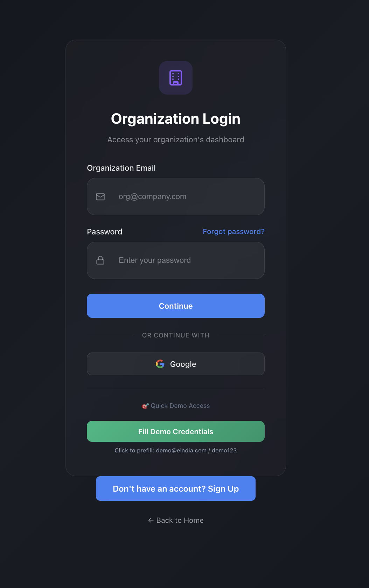
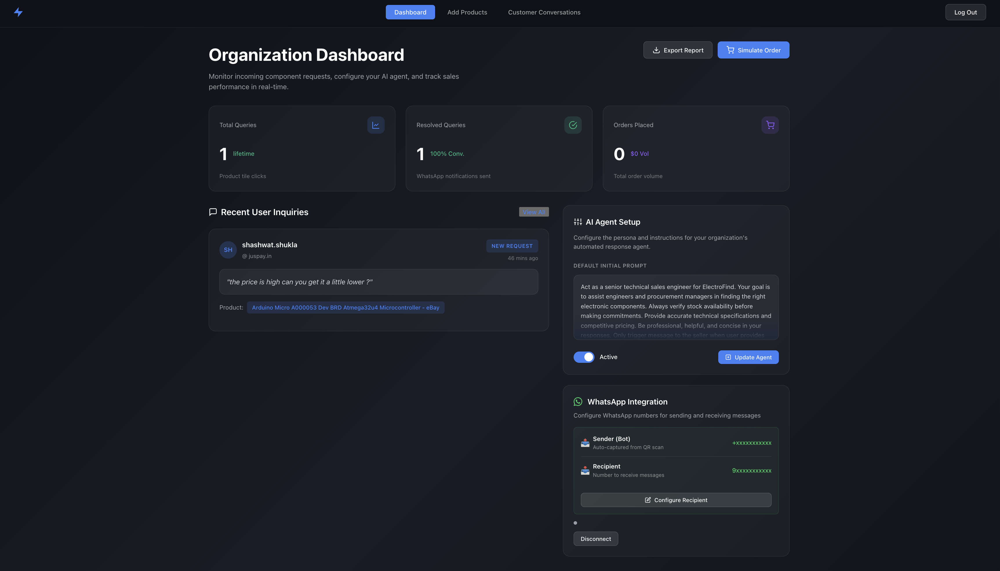
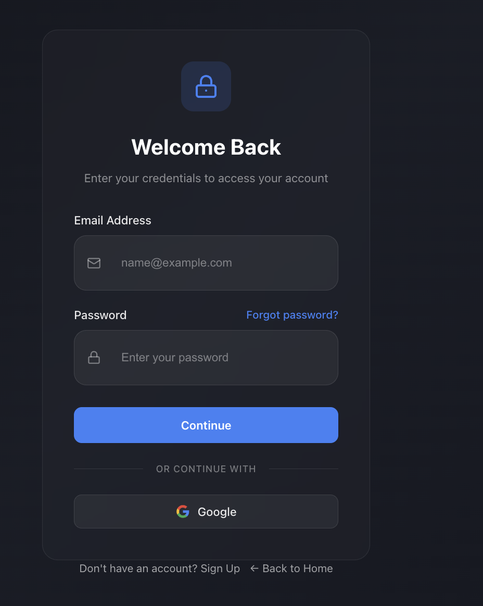
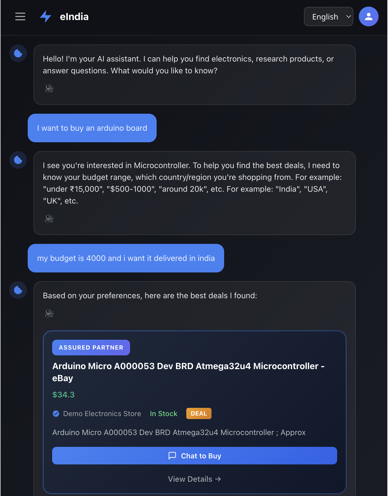

# eIndia - AI-Powered Electronics Shopping Assistant

<p align="center">
  
</p>

<p align="center">
  <strong>Your Intelligent Shopping Companion for Electronics</strong>
</p>

<p align="center">
  <a href="#features">Features</a> •
  <a href="#architecture">Architecture</a> •
  <a href="#getting-started">Getting Started</a> •
  <a href="#screenshots">Screenshots</a> •
  <a href="#api-documentation">API</a>
</p>

---

## 📸 Product Images

### Organization Login

*Secure login page for sellers and organizations*

### Organization Dashboard

*Comprehensive dashboard for sellers to manage AI agent, view analytics, and configure WhatsApp integration*

### User Login

*Customer login interface with Firebase authentication*

### User Chat Conversation

*AI-powered chat interface for customers to discover and inquire about electronic products*

---

## 🌟 Features

### 🤖 AI-Powered Shopping Assistant
- **Smart Product Discovery**: Natural language processing to understand user needs
- **Intelligent Clarification**: Asks targeted questions to narrow down requirements
- **Price Comparison**: Searches across Amazon, Flipkart, niche retailers, and local stores
- **Buy Readiness Detection**: AI analyzes conversations to identify purchase intent

### 🗣️ Multi-Language & Voice Support
- **8 Indian Languages**: English, Hindi, Kannada, Telugu, Tamil, Marathi, Punjabi, Bengali
- **Speech-to-Text**: AWS Transcribe for voice input
- **Text-to-Speech**: AWS Polly for audio responses
- **Real-time Translation**: Seamless language switching

### 💬 Seller AI Agent
- **Customizable Prompts**: Sellers can configure their AI agent's personality
- **WhatsApp Integration**: Automatic notifications when customers are ready to buy
- **Conversation Analytics**: Track queries, conversions, and customer interactions
- **Real-time Chat**: AI handles customer inquiries 24/7

### 📊 Seller Dashboard
- **Performance Metrics**: Total queries, resolved queries, conversion rates
- **Customer Conversations**: View and manage all customer interactions
- **Product Catalog**: Upload and manage inventory (CSV, Excel, PDF)
- **WhatsApp Configuration**: Easy setup for notifications

### 🔧 Technical Features
- **Firebase Authentication**: Secure login with Google and email
- **DynamoDB Persistence**: All data stored in AWS DynamoDB
- **Responsive Design**: Works on desktop, tablet, and mobile
- **Real-time Updates**: WebSocket-like polling for live notifications

---

## 🏗️ Architecture

```
┌─────────────────────────────────────────────────────────────┐
│                        Frontend                             │
│  ┌─────────────┐  ┌─────────────┐  ┌─────────────────────┐ │
│  │   Landing   │  │   Chat      │  │   Seller Dashboard  │ │
│  │   Page      │  │   Interface │  │                     │ │
│  └─────────────┘  └─────────────┘  └─────────────────────┘ │
│                                                              │
│  React + Vite + i18n (Multi-language support)               │
└─────────────────────────────────────────────────────────────┘
                              │
                              ▼
┌─────────────────────────────────────────────────────────────┐
│                      Backend (Node.js)                      │
│  ┌─────────────┐  ┌─────────────┐  ┌─────────────────────┐ │
│  │   Search    │  │   Seller    │  │   WhatsApp          │ │
│  │   API       │  │   Chat API  │  │   Integration       │ │
│  └─────────────┘  └─────────────┘  └─────────────────────┘ │
│                                                              │
│  Express + OpenAI + Tavily + AWS SDK                        │
└─────────────────────────────────────────────────────────────┘
                              │
                              ▼
┌─────────────────────────────────────────────────────────────┐
│                    External Services                        │
│  ┌─────────────┐  ┌─────────────┐  ┌─────────────────────┐ │
│  │   OpenAI    │  │   Tavily    │  │   AWS (Transcribe,  │ │
│  │   GPT-4     │  │   Search    │  │   Polly, DynamoDB)  │ │
│  └─────────────┘  └─────────────┘  └─────────────────────┘ │
│  ┌─────────────┐  ┌─────────────┐  ┌─────────────────────┐ │
│  │   Firebase  │  │   Twilio    │  │   Google Cloud      │ │
│  │   Auth      │  │   WhatsApp  │  │   (Optional)        │ │
│  └─────────────┘  └─────────────┘  └─────────────────────┘ │
└─────────────────────────────────────────────────────────────┘
```

---

## 🚀 Getting Started

### Prerequisites
- Node.js 18+
- AWS Account with DynamoDB, Transcribe, and Polly access
- Firebase project for authentication
- OpenAI API key
- Tavily API key
- Twilio account (for WhatsApp)

### Installation

1. **Clone the repository**
   ```bash
   git clone https://github.com/yourusername/eindia.git
   cd eindia
   ```

2. **Install frontend dependencies**
   ```bash
   npm install
   ```

3. **Install backend dependencies**
   ```bash
   cd backend
   npm install
   ```

4. **Configure environment variables**

   Create `backend/.env`:
   ```env
   # OpenAI
   OPENAI_API_KEY=your_openai_api_key
   OPENAI_BASE_URL=https://api.openai.com/v1

   # Tavily
   TAVILY_API_KEY=your_tavily_api_key

   # AWS
   AWS_REGION=ap-south-1
   AWS_ACCESS_KEY_ID=your_aws_access_key
   AWS_SECRET_ACCESS_KEY=your_aws_secret_key

   # DynamoDB Tables
   DYNAMODB_USER_TABLE=user-table
   DYNAMODB_SELLER_TABLE=seller-table
   DYNAMODB_USER_CHAT_TABLE=user-chat
   DYNAMODB_SELLER_USER_CHAT_TABLE=seller-user-chat

   # Firebase
   FIREBASE_PROJECT_ID=your_firebase_project_id
   FIREBASE_PRIVATE_KEY=your_firebase_private_key
   FIREBASE_CLIENT_EMAIL=your_firebase_client_email

   # Twilio (WhatsApp)
   TWILIO_ACCOUNT_SID=your_twilio_account_sid
   TWILIO_AUTH_TOKEN=your_twilio_auth_token
   TWILIO_WHATSAPP_NUMBER=your_twilio_whatsapp_number

   # S3 (for audio uploads)
   S3_BUCKET=your_s3_bucket_name

   # Server
   PORT=3001
   ```

   Create `.env` in root (for frontend):
   ```env
   VITE_API_BASE_URL=http://localhost:3001/api
   ```

5. **Start the backend server**
   ```bash
   cd backend
   npm start
   ```

6. **Start the frontend**
   ```bash
   npm run dev
   ```

7. **Open your browser**
   Navigate to `http://localhost:5173`

---

## 📱 Screenshots

### Customer Experience

| Feature | Screenshot |
|---------|-----------|
| **User Login** |  |
| **User Chat Conversation** |  |

### Seller Experience

| Feature | Screenshot |
|---------|-----------|
| **Organization Login** |  |
| **Organization Dashboard** |  |

---

## 📚 API Documentation

### Authentication
- `POST /api/auth/verify` - Verify Firebase user token
- `POST /api/auth/verify-seller` - Verify Firebase seller token
- `POST /api/auth/demo-seller-login` - Demo login for testing

### Product Search
- `POST /api/search` - Search for products with AI clarification

### Seller Chat
- `POST /api/seller/chat/start` - Start new chat session
- `POST /api/seller/chat/message` - Send message in chat
- `GET /api/seller/chat/:sessionId` - Get chat history
- `POST /api/seller/chat/analyze` - Analyze conversation for purchase intent

### WhatsApp Integration
- `POST /api/whatsapp/connect` - Initialize WhatsApp connection
- `GET /api/whatsapp/status/:sellerId` - Get connection status
- `POST /api/whatsapp/config` - Save recipient number

### Seller Stats
- `GET /api/seller/stats/:sellerId` - Get seller statistics
- `POST /api/seller/stats/query` - Increment query count
- `POST /api/seller/stats/resolved` - Increment resolved count

---

## 🛠️ Technology Stack

### Frontend
- **React 18** - UI framework
- **Vite** - Build tool
- **i18next** - Internationalization
- **CSS Modules** - Styling

### Backend
- **Node.js** + **Express** - Server framework
- **OpenAI API** - LLM for conversational AI
- **Tavily API** - Product search and price comparison
- **AWS SDK** - Transcribe, Polly, DynamoDB, S3
- **Twilio** - WhatsApp messaging
- **Firebase Admin** - Authentication

### Database
- **AWS DynamoDB** - NoSQL database for users, sellers, chats, and conversations

---

## 🤝 Contributing

We welcome contributions! Please read our [Contributing Guide](CONTRIBUTING.md) for details on our code of conduct and the process for submitting pull requests.

## 📝 License

This project is licensed under the MIT License - see the [LICENSE](LICENSE) file for details.

## 🙏 Acknowledgments

- OpenAI for GPT-4 API
- Tavily for search API
- AWS for cloud services
- Firebase for authentication
- Twilio for WhatsApp integration

---

<p align="center">
  Made with ❤️ for the Indian electronics market
</p>